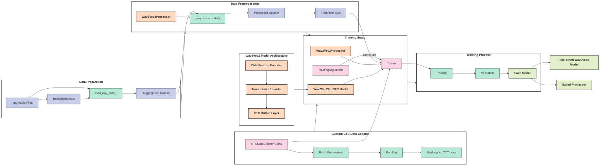

```mermaid
flowchart LR
    %% Define styles
    classDef dataBlock fill:#c7ceea,stroke:#333,stroke-width:1px,color:#333
    classDef processBlock fill:#b5ead7,stroke:#333,stroke-width:1px,color:#333
    classDef modelBlock fill:#ffdac1,stroke:#333,stroke-width:2px,color:#333,font-weight:bold
    classDef collatorBlock fill:#f9d5e5,stroke:#333,stroke-width:1px,color:#333
    classDef outputBlock fill:#e2f0cb,stroke:#333,stroke-width:2px,color:#333,font-weight:bold
    classDef mainProcess fill:#ffffff,stroke:#333,stroke-width:2px,color:#333,font-weight:bold
    
    %% Data Preparation
    subgraph DataPrep["Data Preparation"]
        direction TB
        A[".npy Audio Files"] --> B["transcriptions.txt"]
        A & B --> C["load_npy_data()"]
        C --> D["HuggingFace Dataset"]
    end
    
    %% Data Preprocessing
    subgraph DataProcess["Data Preprocessing"]
        direction TB
        D --> E["preprocess_data()"]
        F["Wav2Vec2Processor"] --> E
        E --> G["Processed Dataset"]
        G --> H["Train/Test Split"]
    end
    
    %% Custom Collator
    subgraph Collator["Custom CTC Data Collator"]
        direction TB
        I["CTCDataCollator Class"]
        I --> J["Batch Preparation"]
        J --> K["Padding"]
        K --> L["Masking for CTC Loss"]
    end
    
    %% Training Setup
    subgraph TrainSetup["Training Setup"]
        direction TB
        M["TrainingArguments"]
        M --> |"Configure"| N["Trainer"]
        H --> N
        F2["Wav2Vec2Processor"] --> N
        O["Wav2Vec2ForCTC Model"] --> N
        I --> N
    end
    
    %% Training Process
    subgraph TrainProcess["Training Process"]
        direction TB
        N --> P["Training"]
        P --> Q["Validation"]
        Q --> R["Save Model"]
    end
    
    %% Model Architecture
    subgraph ModelArch["Wav2Vec2 Model Architecture"]
        direction TB
        S["CNN Feature Encoder"] --> T["Transformer Encoder"]
        T --> U["CTC Output Layer"]
    end
    
    %% Main Flow Connection
    DataPrep --> DataProcess
    DataProcess --> TrainSetup
    Collator --> TrainSetup
    TrainSetup --> TrainProcess
    ModelArch --> O
    
    %% Final Output
    R --> V["Fine-tuned Wav2Vec2 Model"] 
    R --> W["Saved Processor"]
    
    %% Apply styles
    class A,B,D,G,H dataBlock
    class C,E,J,K,L,P,Q processBlock
    class F,F2,O,S,T,U modelBlock
    class I,M,N collatorBlock
    class R,V,W outputBlock
    class DataPrep,DataProcess,Collator,TrainSetup,TrainProcess,ModelArch mainProcess
```